# Digital Alarm Clock — VLSI Design Project

A 24-hour digital alarm clock designed in Verilog HDL, simulated using Cadence, 
and synthesized using fast and slow standard cell libraries.

---

## File Structure

```
digital-alarm-clock-verilog/
├── rtl/
│   └── alarm_clock.v
├── simulation/
│   └── alarm_clock_TB.v
├── constraint/
│   └── constraints_top.sdc
├── synthesis/
│   └── rc_script.tcl
└── reports/
├── waveforms/
│   ├── reset_function.png
│   ├── one_minute.png
│   ├── one_hour.png
│   └── alarm_flag.png
└── synthesis/
├── schematic_fast.png
    ├── schematic_slow.png
    ├── power_fast.png
    ├── power_slow.png
    ├── netlist_stats_fast.png
    ├── netlist_stats_slow.png
    ├── gate_count_fast.png
    └── gate_count_slow.png
```
---

## Simulation Results

### Reset Function
At 5ns the reset signal goes high, updating the seconds, minutes and hours to the reset inputs. At 10ns the reset is deasserted and
normal clock operation resumes.

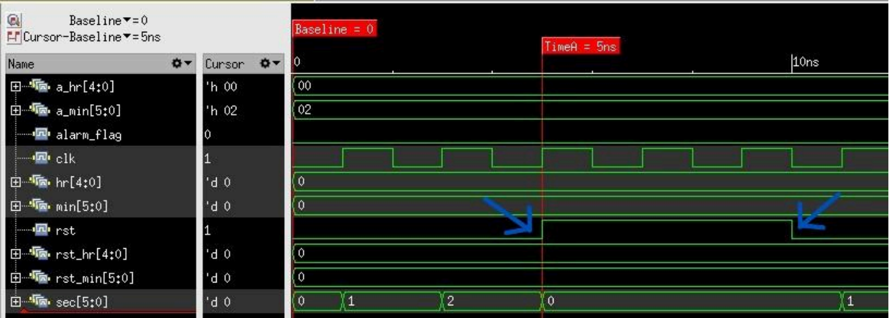

---

### Seconds to Minutes Rollover
When the seconds counter reaches 59, it resets to 0 on the next positive clock edge and the minutes counter increments by 1.

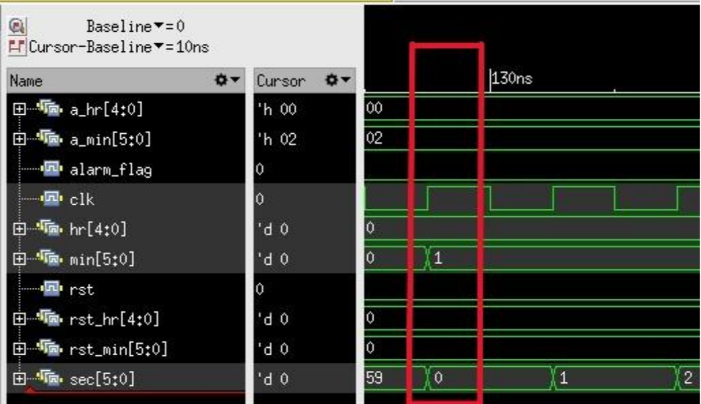

---

### Minutes to Hours Rollover
When the minutes counter reaches 59, it resets to 0 on the next positive
clock edge and the hours counter increments by 1.

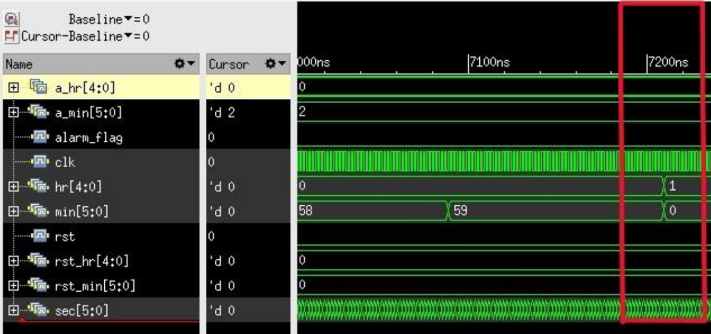

---

### Alarm Flag Triggered at 2 Minutes
When the current time matches the preset alarm time (00:02), the alarm
flag is immediately asserted. It remains high for exactly one minute
and automatically deasserts once the time no longer matches.

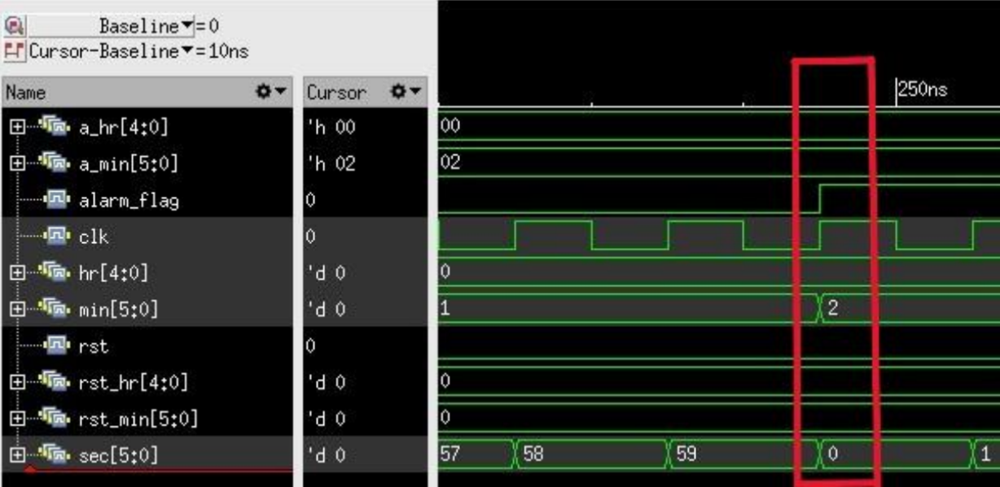

---

## Synthesis Results

### Schematic View
| Fast Library | Slow Library |
|---|---|
| 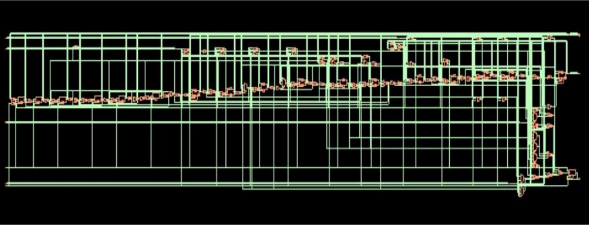 | 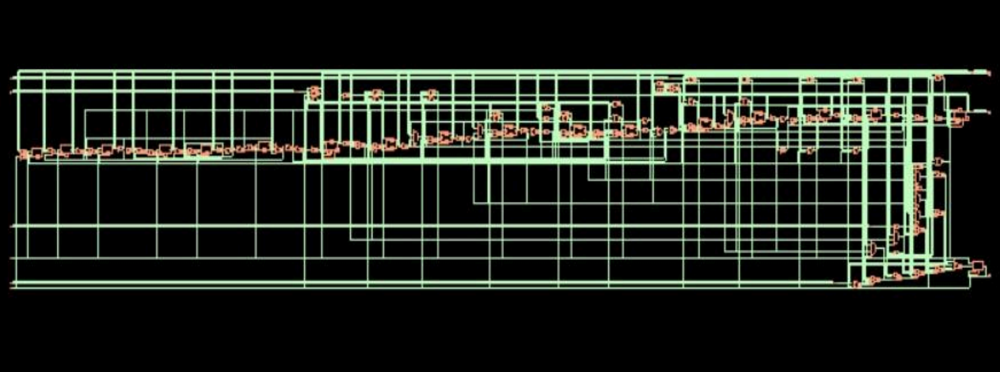 |

---

### Power Report
| Fast Library | Slow Library |
|---|---|
| 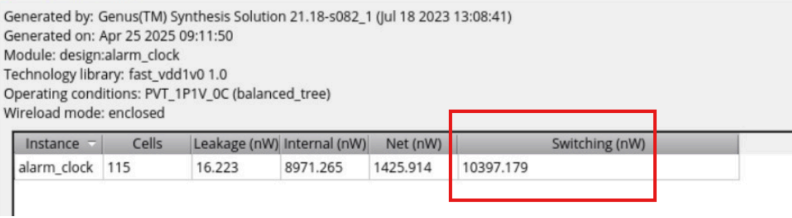 | 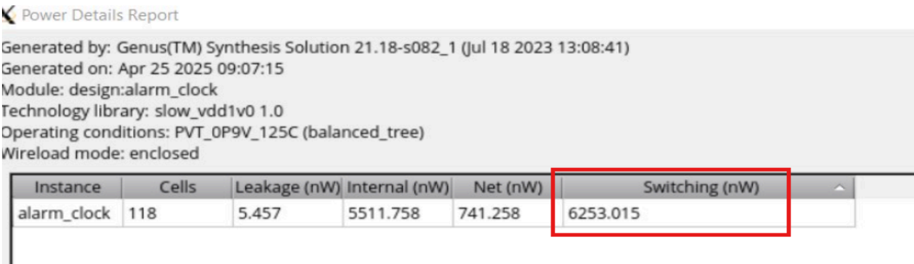 |

---

### Netlist Statistics
| Fast Library | Slow Library |
|---|---|
| 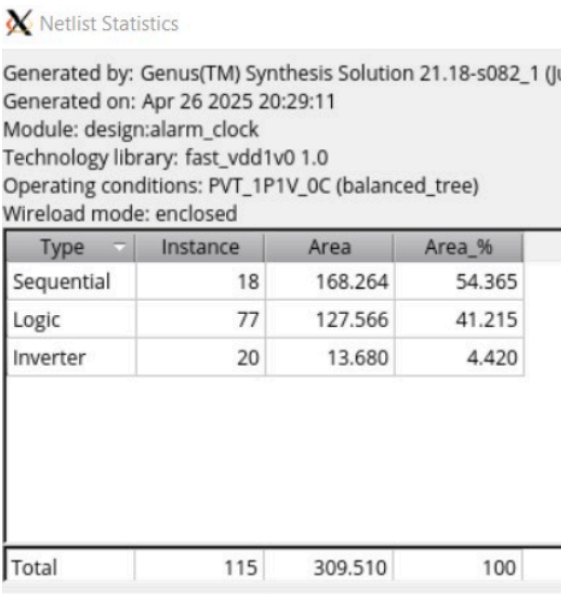 | 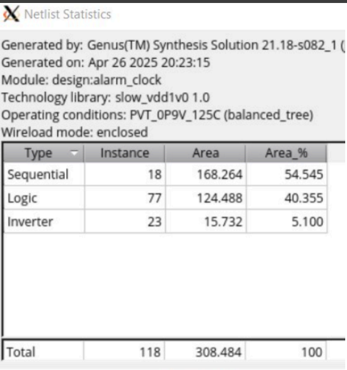 |

---

### Gate Count Report
| Fast Library | Slow Library |
|---|---|
| 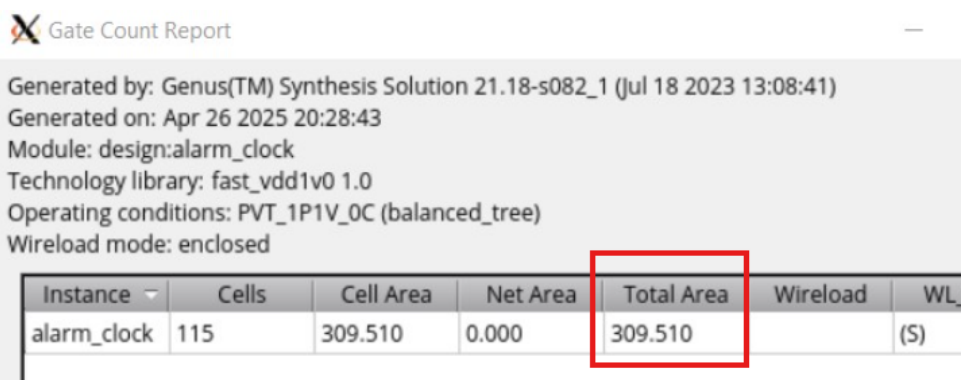 | 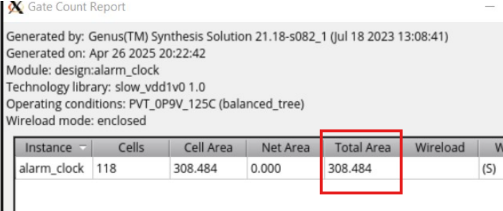 |


